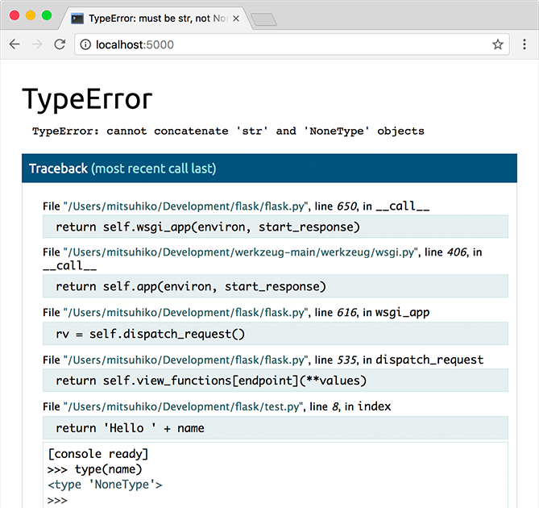

# Быстрый старт Flask

## Быстрый старт

Хотите начать? Эта страница дает хорошее представление о **Flask**. Предполагается, что у вас уже установлен **Flask**. Если вы этого не сделали, перейдите в раздел «[Установка](ustanovka.md#ustanovka)».

### Минимальное приложение

Минимальное приложение Flask выглядит примерно так:

```python
from flask import Flask
app = Flask(__name__)

@app.route('/')
def hello_world():
    return 'Hello, World!'
```

Так что же делал этот код?

1. Сначала мы импортировали класс **Flask**. Экземпляр этого класса будет нашим приложением **WSGI**.
2. Затем мы создаем экземпляр этого класса. Первый аргумент - это имя модуля или пакета приложения. Если вы используете один модуль (как в этом примере), вам следует использовать `__name__`, потому что в зависимости от того, запущен ли он как приложение или импортирован как модуль, имя будет другим (`'__main__'` по сравнению с фактическим именем импорта). Это необходимо для того, чтобы **Flask** знал, где искать шаблоны, статические файлы и т. Д. Для получения дополнительной информации см. Документацию **Flask**.
3. Затем мы используем декоратор **route ()**, чтобы сообщить **Flask**, какой URL-адрес должен запускать нашу функцию.
4. Функция получает имя, которое также используется для генерации URL-адресов для этой конкретной функции, и возвращает сообщение, которое мы хотим отобразить в браузере пользователя.

Просто сохраните его как `hello.py` или что-то подобное. Убедитесь, что вы не вызываете свое приложение `flask.py`, потому что это может конфликтовать с самим **Flask**.

Чтобы запустить приложение, вы можете использовать команду **flask** или переключатель python `-m` с **Flask**. Прежде чем вы сможете это сделать, вам нужно указать своему терминалу, с каким приложением будет работать, экспортировав переменную среды `FLASK_APP`:

```bash
$ export FLASK_APP=hello.py
$ flask run
 * Running on http://127.0.0.1:5000/
```

Если вы работаете в **Windows**, синтаксис переменной среды зависит от интерпретатора командной строки. В командной строке:

```bash
C:\path\to\app>set FLASK_APP=hello.py
```

И в **PowerShell**:

```bash
PS C:\path\to\app> $env:FLASK_APP = "hello.py"
```

В качестве альтернативы вы можете использовать `python -m flask`:

```bash
$ export FLASK_APP=hello.py
$ python -m flask run
 * Running on http://127.0.0.1:5000/
```

Это запускает очень простой встроенный сервер, который достаточно хорош для тестирования, но, вероятно, не тот, который вы хотите использовать в производстве. Варианты развертывания см. в разделе «Варианты развертывания».

Теперь перейдите на `http://127.0.0.1:5000/`, и вы должны увидеть свое приветствие **hello world**.


**Внешне видимый сервер**

Если вы запустите сервер, вы заметите, что сервер доступен только с вашего собственного компьютера, а не с любого другого в сети. Это значение по умолчанию, поскольку в режиме отладки пользователь приложения может выполнять произвольный код **Python** на вашем компьютере.

Если у вас отключен отладчик или вы доверяете пользователям в своей сети, вы можете сделать сервер общедоступным, просто добавив `--host = 0.0.0.0` в командную строку:

`$ flask run --host=0.0.0.0`

Это указывает вашей операционной системе прослушивать все общедоступные IP-адреса.


### Что делать, если Сервер не запускается

В случае сбоя команды `python -m flask` или отсутствия `flask` может быть несколько причин. Прежде всего, вам нужно посмотреть сообщение об ошибке.

#### Старая версия Flask

В версиях **Flask** до 0.11 раньше были разные способы запуска приложения. Короче говоря, команды **flask** не существовало, как и `python -m flask`. В этом случае у вас есть два варианта: либо перейти на более новую версию **Flask**, либо просмотреть документацию по серверу разработки, чтобы увидеть альтернативный метод запуска сервера.

#### Недействительное имя импорта

Переменная среды `FLASK_APP` - это имя модуля, импортируемого при запуске **Flask**. Если этот модуль назван неверно, вы получите сообщение об ошибке импорта при запуске (или если включена отладка при переходе к приложению). Он сообщит вам, что он пытался импортировать и почему это не удалось.

Наиболее частая причина - опечатка или то, что вы на самом деле не создали объект приложения **app**.

### Режим отладки

(Хотите просто регистрировать ошибки и трассировку стека? См. ошибки приложений)

Сценарий **flask** хорош для запуска локального сервера разработки, но вам придется перезапускать его вручную после каждого изменения вашего кода. Это не очень хорошо, и **Flask** может работать лучше. Если вы включите поддержку отладки, сервер будет перезагружаться при изменении кода, а также предоставит вам полезный отладчик, если что-то пойдет не так.

Чтобы включить все функции разработки (включая режим отладки), вы можете экспортировать переменную среды **FLASK\_ENV** и установить ее для разработки перед запуском сервера:

```bash
$ export FLASK_ENV=development
$ flask run
```

(В **Windows** вам нужно использовать **set** вместо **export**.)

Это делает следующее:

1. он активирует отладчик
2. он активирует автоматический перезагрузчик
3. он включает режим отладки в приложении **Flask**.

Вы также можете управлять режимом отладки отдельно от среды, экспортировав `FLASK_DEBUG = 1`.

Есть и другие параметры, которые описаны в документации по серверу разработки.


**Внимание:**

Несмотря на то, что интерактивный отладчик не работает в разветвленных средах (что делает его практически невозможным для использования на производственных серверах), он по-прежнему позволяет выполнять произвольный код. Это создает серьезную угрозу безопасности, и поэтому его **нельзя использовать на производственных машинах**.


Скриншот отладчика в действии:



Более подробную информацию об использовании отладчика можно найти в [документации Werkzeug](https://werkzeug.palletsprojects.com/en/1.0.x/debug/#using-the-debugger).

Имеете в виду еще один отладчик? См. работа с отладчиками.

### Маршрутизация

Современные веб-приложения используют понятные URL-адреса, чтобы помочь пользователям. Пользователи с большей вероятностью полюбят страницу и вернутся, если на странице используется значимый URL-адрес, который они могут запомнить и использовать для прямого посещения страницы.

Используйте декоратор **route ()** для привязки функции к URL-адресу.

```python
@app.route('/')
def index():
    return 'Index Page'

@app.route('/hello')
def hello():
    return 'Hello, World'
```

Вы можете больше! Вы можете сделать части URL-адреса динамическими и прикрепить к функции несколько правил.

### Правила для переменных маршрутов

Вы можете добавить разделы переменных к URL-адресу, пометив разделы с помощью `<variable_name>`. Затем ваша функция получает `<variable_name>` в качестве аргумента ключевого слова. При желании вы можете использовать преобразователь, чтобы указать тип аргумента, например `<converter: variable_name>`.

```python
from markupsafe import escape

@app.route('/user/<username>')
def show_user_profile(username):
    # показать профиль этого пользователя
    return 'User %s' % escape(username)

@app.route('/post/<int:post_id>')
def show_post(post_id):
    # показать сообщение с заданным идентификатором, идентификатор - целое число
    return 'Post %d' % post_id

@app.route('/path/<path:subpath>')
def show_subpath(subpath):
    # показать подпуть после /path/
    return 'Subpath %s' % escape(subpath)
```

Типы конвертеров:

| Тип        | Описание                                             |
| ---------- | ---------------------------------------------------- |
| **string** | (по умолчанию) принимает любой текст без косой черты |
| **int**    | принимает положительные целые числа                  |
| **float**  | принимает положительные значения с плавающей запятой |
| **path**   | как **string**, но также принимает косые черты       |
| **uuid**   | принимает строки UUID                                |

### Уникальные URL-адреса / поведение при перенаправлении

Следующие два правила отличаются использованием в конце косой черты.

```python
@app.route('/projects/')
def projects():
    return 'The project page'

@app.route('/about')
def about():
    return 'The about page'
```

Канонический URL-адрес конечной точки проекта `projects` заканчивается косой чертой. Это похоже на папку в файловой системе. Если вы обращаетесь к URL без косой черты, **Flask** перенаправляет вас на канонический URL с косой чертой в конце.

Канонический URL-адрес для конечной точки `about` не имеет косой черты в конце. Это похоже на путь к файлу. Доступ к URL-адресу с косой чертой в конце вызывает ошибку 404 «Не найдено». Это помогает сохранять уникальные URL-адреса для этих ресурсов, что помогает поисковым системам избегать двойного индексирования одной и той же страницы.

### Создание URL

Чтобы создать URL-адрес определенной функции, используйте функцию **url\_for ()**. Она принимает имя функции в качестве своего первого аргумента и любое количество аргументов ключевого слова, каждый из которых соответствует переменной части правила URL. Части неизвестных переменных добавляются к URL-адресу как параметры запроса.

Зачем вам создавать URL-адреса с помощью функции изменения URL-адресов **url\_for ()** вместо того, чтобы жестко кодировать их в своих шаблонах?

1. Реверсирование часто более наглядно, чем жесткое кодирование URL-адресов.
2. Вы можете изменить свои URL-адреса за один раз, вместо того, чтобы не забывать вручную изменять жестко заданные URL-адреса.
3. Создание URL-адресов прозрачно обрабатывает экранирование специальных символов и данных Unicode.
4. Сгенерированные пути всегда абсолютны, что позволяет избежать неожиданного поведения относительных путей в браузерах.
5. Если ваше приложение размещено вне корневого URL-адреса, например, в `/myapplication` вместо `/`, **url\_for ()** правильно обработает это за вас.

Например, здесь мы используем метод **test\_request\_context ()**, чтобы опробовать **url\_for ()**. **test\_request\_context ()** сообщает **Flask**, что он должен вести себя так, как будто он обрабатывает запрос, даже если мы используем оболочку **Python**. См. контекстные локальные переменные

```python
from flask import Flask, url_for
from markupsafe import escape

app = Flask(__name__)

@app.route('/')
def index():
    return 'index'

@app.route('/login')
def login():
    return 'login'

@app.route('/user/<username>')
def profile(username):
    return '{}\'s profile'.format(escape(username))

with app.test_request_context():
    print(url_for('index'))
    print(url_for('login'))
    print(url_for('login', next='/'))
    print(url_for('profile', username='John Doe'))
```

Ответ:

```bash
/
/login
/login?next=/
/user/John%20Doe
```

### HTTP-методы

Веб-приложения используют разные методы HTTP при доступе к URL-адресам. При работе с **Flask** вам следует ознакомиться с методами HTTP. По умолчанию маршрут отвечает только на запросы **GET**. Вы можете использовать аргумент **methods** декоратора **route ()** для обработки различных HTTP-методов.

```python
from flask import request

@app.route('/login', methods=['GET', 'POST'])
def login():
    if request.method == 'POST':
        return do_the_login()
    else:
        return show_the_login_form()
```

Если присутствует **GET**, **Flask** автоматически добавляет поддержку метода **HEAD** и обрабатывает запросы **HEAD** в соответствии с [HTTP RFC](https://www.ietf.org/rfc/rfc2068.txt). Аналогичным образом, **OPTIONS** автоматически реализуется для вас.

### Статические файлы

Динамическим веб-приложениям также нужны статические файлы. Обычно отсюда берутся файлы **CSS** и **JavaScript**. В идеале ваш веб-сервер настроен для их обслуживания, но во время разработки **Flask** может это сделать. Просто создайте папку **static** в вашем пакете или рядом с вашим модулем, и она будет доступна в `/static` в приложении.

Чтобы сгенерировать URL-адреса для статических файлов, используйте специальное имя `'static'` конечной точки:

```python
url_for('static', filename='style.css')
```

Файл должен храниться в файловой системе как `static/style.css`.

### Шаблоны рендеринга

Генерировать HTML из **Python** - это не весело и на самом деле довольно громоздко, потому что вам нужно самостоятельно выполнять экранирование HTML, чтобы обеспечить безопасность приложения. Из-за этого **Flask** автоматически настраивает шаблонизатор **Jinja2**.

Для визуализации шаблона вы можете использовать метод **render\_template ()**. Все, что вам нужно сделать, это указать имя шаблона и переменные, которые вы хотите передать в механизм шаблонов в качестве аргументов ключевого слова. Вот простой пример того, как визуализировать шаблон:

```python
from flask import render_template

@app.route('/hello/')
@app.route('/hello/<name>')
def hello(name=None):
    return render_template('hello.html', name=name)
```

**Flask** будет искать шаблоны в папке шаблонов `templates`. Итак, если ваше приложение является модулем, эта папка находится рядом с этим модулем, если это пакет, то на самом деле она находится внутри вашего пакета:

Случай 1: модуль:

```bash
/application.py
/templates
    /hello.html
```

Случай 2: пакет:

```bash
/application
    /__init__.py
    /templates
        /hello.html
```

Для шаблонов вы можете использовать всю мощь шаблонов **Jinja2**. Для получения дополнительной информации перейдите в официальную [документацию по шаблону Jinja2](../../../shablonizatory/jinja/).

Вот пример шаблона:

```python
<!doctype html>
<title>Hello from Flask</title>


  <h1>Hello {{ name }}!</h1>

  <h1>Hello, World!</h1>


```

Внутри шаблонов у вас также есть доступ к объектам **request**, **session** и **g** \[1], а также к функции **get\_flashed\_messages ()**.

Шаблоны особенно полезны при использовании наследования. Если вы хотите узнать, как это работает, обратитесь к документации по наследованию шаблонов. В основном наследование шаблонов позволяет сохранять определенные элементы на каждой странице (например, заголовок, навигацию и нижний колонтитул).

Включено автоматическое экранирование, поэтому, если **name** содержит HTML, оно будет экранировано автоматически. Если вы можете доверять переменной и знаете, что это будет безопасный HTML (например, потому что он получен из модуля, конвертирующего разметку wiki в HTML), вы можете пометить ее как безопасную, используя класс разметки **Markup** или фильтр `| safe` в шаблоне. Перейдите к документации **Jinja 2**, чтобы увидеть больше примеров.

Вот базовое введение в работу класса **Markup**:

```python
>>> from markupsafe import Markup
>>> Markup('<strong>Hello %s!</strong>') % '<blink>hacker</blink>'
Markup(u'<strong>Hello &lt;blink&gt;hacker&lt;/blink&gt;!</strong>')
>>> Markup.escape('<blink>hacker</blink>')
Markup(u'&lt;blink&gt;hacker&lt;/blink&gt;')
>>> Markup('<em>Marked up</em> &raquo; HTML').striptags()
u'Marked up \xbb HTML'
```

_Изменено в версии 0.5:_ Автоэскейп больше не включен для всех шаблонов. Следующие расширения для шаблонов запускают автоматическое экранирование: `.html`, `.htm`, `.xml`, `.xhtml`. Для шаблонов, загруженных из строки, будет отключено автоматическое экранирование.

\[1] Не уверены, что это за объект **g**? Это то, в чем вы можете хранить информацию для своих нужд. Дополнительную информацию можно найти в документации по этому объекту (**g**) и в использование **SQLite 3** с **Flask**.

### Доступ к данным запроса

Для веб-приложений критически важно реагировать на данные, которые клиент отправляет на сервер. В **Flask** эта информация предоставляется глобальным объектом запроса **request**. Если у вас есть некоторый опыт работы с **Python**, вам может быть интересно, как этот объект может быть глобальным и как **Flask** удается поддерживать потокобезопасность. Ответ - контекстные локальные данные:

### Контекстные локальные данные


**Внутренняя информация:**

Если вы хотите понять, как это работает и как можно реализовать тесты с локальными переменными контекста, прочтите этот раздел, иначе просто пропустите его.


Некоторые объекты во **Flask** являются глобальными, но не обычного типа. Эти объекты фактически являются прокси для объектов, локальных для определенного контекста. Какое-то непонятное сочетание. Но на самом деле это довольно легко понять.

Представьте, что контекст - это поток обработки. Поступает запрос, и веб-сервер решает создать новый поток (или что-то еще, базовый объект способен работать с системами параллелизма, отличными от потоков). Когда **Flask** начинает обработку внутреннего запроса, он определяет, что текущий поток является активным контекстом, и связывает текущее приложение и среды **WSGI** с этим контекстом (потоком). Он делает это разумно, так что одно приложение может вызывать другое приложение без прерывания работы.

Так что это значит для тебя? По сути, вы можете полностью игнорировать это, если только вы не делаете что-то вроде модульного тестирования. Вы заметите, что код, зависящий от объекта запроса, внезапно сломается из-за отсутствия объекта запроса. Решение состоит в том, чтобы самостоятельно создать объект запроса и привязать его к контексту. Самым простым решением для модульного тестирования является использование диспетчера контекста **test\_request\_context ()**. В сочетании с оператором **with** он связывает тестовый запрос, чтобы вы могли с ним взаимодействовать. Вот пример:

```python
from flask import request

with app.test_request_context('/hello', method='POST'):
    # теперь вы можете что-то делать с запросом до конца
    # блока with, например, базовые утверждения:
    assert request.path == '/hello'
    assert request.method == 'POST'
```

Другая возможность - передать всю среду **WSGI** методу **request\_context ()**:

```python
from flask import request

with app.request_context(environ):
    assert request.method == 'POST'
```

### Объект запроса

Объект запроса задокументирован в разделе API, и мы не будем рассматривать его здесь подробно (см. **Request**). Вот общий обзор некоторых из наиболее распространенных операций. Прежде всего вам нужно импортировать его из модуля **flask**:

```python
from flask import request
```

Текущий метод запроса доступен с помощью атрибута **method**. Для доступа к данным формы (данным, передаваемым в запросах **POST** или **PUT**) вы можете использовать атрибут формы **form**. Вот полный пример двух упомянутых выше атрибутов:

```python
@app.route('/login', methods=['POST', 'GET'])
def login():
    error = None
    if request.method == 'POST':
        if valid_login(request.form['username'],
                       request.form['password']):
            return log_the_user_in(request.form['username'])
        else:
            error = 'Invalid username/password'
    # приведенный ниже код выполняется, если
    # метод запроса был GET или учетные данные недействительны
    return render_template('login.html', error=error)
```

Что произойдет, если ключ не существует в атрибуте **form**? В этом случае возникает особая ошибка [**KeyError**](https://docs.python.org/3/library/exceptions.html#KeyError). Вы можете поймать это как стандартную ошибку **KeyError**, но если вы этого не сделаете, вместо этого будет показана страница с ошибкой `HTTP 400 Bad Request`. Так что во многих ситуациях вам не придется сталкиваться с этой проблемой.

Для доступа к параметрам, представленным в URL-адресе (`?Key=value`), вы можете использовать атрибут **args**:

```python
searchword = request.args.get('key', '')
```

Мы рекомендуем обращаться к параметрам URL-адреса с помощью **get** или путем перехвата [**KeyError**](https://docs.python.org/3/library/exceptions.html#KeyError), потому что пользователи могут изменить URL-адрес и представить им страницу с ошибочным запросом **400** в этом случае, что неудобно для пользователя.

Полный список методов и атрибутов объекта запроса см. в документации по запросу **Request**.

### Загрузка файлов

Вы можете легко обрабатывать загруженные файлы с помощью **Flask**. Только не забудьте установить атрибут `enctype="multipart/form-data"` в вашей HTML-форме, иначе браузер вообще не будет передавать ваши файлы.

Загруженные файлы хранятся в памяти или во временном месте файловой системы. Вы можете получить доступ к этим файлам, используя атрибут **files** в объекте запроса **request**. Каждый загруженный файл хранится в этом словаре. Он ведет себя так же, как стандартный файловый объект **Python**, но также имеет метод **save ()**, который позволяет вам сохранять этот файл в файловой системе сервера. Вот простой пример, показывающий, как это работает:

```python
from flask import request

@app.route('/upload', methods=['GET', 'POST'])
def upload_file():
    if request.method == 'POST':
        f = request.files['the_file']
        f.save('/var/www/uploads/uploaded_file.txt')
    ...
```

Если вы хотите знать, как файл был назван на стороне клиента до того, как он был загружен в ваше приложение, вы можете получить доступ к атрибуту имени файла [**filename**](https://werkzeug.palletsprojects.com/en/1.0.x/datastructures/#werkzeug.datastructures.FileStorage.filename). Однако имейте в виду, что это значение можно подделать, поэтому никогда не доверяйте этому значению. Если вы хотите использовать имя файла клиента для хранения файла на сервере, передайте его через функцию [**secure\_filename ()**](https://werkzeug.palletsprojects.com/en/1.0.x/utils/#werkzeug.utils.secure\_filename), которую **Werkzeug** предоставляет вам:

```python
from flask import request
from werkzeug.utils import secure_filename

@app.route('/upload', methods=['GET', 'POST'])
def upload_file():
    if request.method == 'POST':
        f = request.files['the_file']
        f.save('/var/www/uploads/' + secure_filename(f.filename))
    ...
```

Для получения лучших примеров ознакомьтесь с шаблоном «Загрузка файлов».

### Cookies

Для доступа к файлам **cookie** вы можете использовать атрибут **cookies**. Чтобы установить файлы cookie, вы можете использовать метод **set\_cookie** объектов ответа **response**. Атрибут **cookies** объектов запроса - это словарь со всеми файлами cookies, которые передает клиент. Если вы хотите использовать сеансы, не используйте файлы cookies напрямую, а вместо этого используйте сеансы **Sessions** во **Flask**, которые повышают безопасность файлов cookie для вас.

Чтение cookies:

```python
from flask import request

@app.route('/')
def index():
    username = request.cookies.get('username')
    # используйте cookies.get(key) вместо cookies[key],
    # чтобы не получить KeyError, если cookie отсутствует.
```

Сохранение cookies:

```python
from flask import make_response

@app.route('/')
def index():
    resp = make_response(render_template(...))
    resp.set_cookie('username', 'the username')
    return resp
```

Обратите внимание, что cookies устанавливаются для объектов ответа. Поскольку вы обычно просто возвращаете строки из функций просмотра, **Flask** преобразует их для вас в объекты ответа. Если вы явно хотите сделать это, вы можете использовать функцию **make\_response ()**, а затем изменить ее.

Иногда вам может потребоваться установить cookie в точке, где объект ответа еще не существует. Это возможно за счет использования шаблона обратных вызовов отложенного запроса.

Для этого также см. Об ответах **Response**.

### Перенаправления и ошибки

Чтобы перенаправить пользователя на другую конечную точку, используйте функцию **redirect ()**; чтобы преждевременно прервать запрос с кодом ошибки, используйте функцию **abort ()**:

```python
from flask import abort, redirect, url_for

@app.route('/')
def index():
    return redirect(url_for('login'))

@app.route('/login')
def login():
    abort(401)
    this_is_never_executed()
```

Это довольно бессмысленный пример, потому что пользователь будет перенаправлен из **index** на страницу, к которой он не может получить доступ (401 означает отказано в доступе), но он показывает, как это работает.

По умолчанию для каждого кода ошибки отображается черно-белая страница ошибки. Если вы хотите настроить страницу ошибки, вы можете использовать декоратор **errorhandler ()**:

```python
from flask import render_template

@app.errorhandler(404)
def page_not_found(error):
    return render_template('page_not_found.html'), 404
```

Обратите внимание на 404 после вызова **render\_template ()**. Это сообщает **Flask**, что код состояния этой страницы должен быть 404, что означает не найдена. По умолчанию предполагается 200, что означает: все прошло хорошо.

Подробнее см. Обработчики ошибок.

### Об ответах Response

Значение, возвращаемое функцией просмотра, автоматически преобразуется в объект ответа для вас. Если возвращаемое значение представляет собой строку, оно преобразуется в объект ответа со строкой в качестве тела ответа, кодом состояния `200 OK` и `mimetype text/html`. Если возвращаемое значение - словарь, вызывается **jsonify ()** для получения ответа. Логика, которую **Flask** применяет для преобразования возвращаемых значений в объекты ответа, следующая:

1. Если возвращается объект ответа правильного типа, он возвращается непосредственно из представления.
2. Если это строка, создается объект ответа с этими данными и параметрами по умолчанию.
3. Если это словарь, объект ответа создается с помощью **jsonify**.
4. Если возвращается кортеж, элементы в кортеже могут предоставить дополнительную информацию. Такие кортежи должны быть в форме (**response**, **status**), (**response**, **headers**) или (**response**, **status**, **headers**). Значение **status** будет иметь приоритет над кодом статуса, а заголовки **headers** могут быть списком или словарем дополнительных значений заголовков.
5. Если ничего из этого не работает, **Flask** будет считать, что возвращаемое значение является допустимым приложением **WSGI**, и преобразует его в объект ответа.

Если вы хотите получить объект ответа внутри представления, вы можете использовать функцию **make\_response ()**.

Представьте, что у вас есть такое представление:

```python
@app.errorhandler(404)
def not_found(error):
    return render_template('error.html'), 404
```

Вам просто нужно обернуть возвращаемое выражение с помощью **make\_response ()** и получить объект ответа для его изменения, а затем вернуть его:

```python
@app.errorhandler(404)
def not_found(error):
    resp = make_response(render_template('error.html'), 404)
    resp.headers['X-Something'] = 'A value'
    return resp
```

### API с JSON

Распространенным форматом ответа при написании API является **JSON**. Начать писать такой API с помощью **Flask** несложно. Если вы вернете словарь **dict** из представления, он будет преобразован в ответ **JSON**.

```python
@app.route("/me")
def me_api():
    user = get_current_user()
    return {
        "username": user.username,
        "theme": user.theme,
        "image": url_for("user_image", filename=user.image),
    }
```

В зависимости от вашего дизайна API вы можете создать ответы **JSON** для типов, отличных от **dict**. В этом случае используйте функцию **jsonify ()**, которая сериализует любой поддерживаемый тип данных **JSON**. Или изучите расширения сообщества **Flask**, которые поддерживают более сложные приложения.

```python
@app.route("/users")
def users_api():
    users = get_all_users()
    return jsonify([user.to_json() for user in users])
```

### Сессии

В дополнение к объекту запроса есть также второй объект, называемый сеансом **session**, который позволяет вам хранить информацию, специфичную для пользователя, от одного запроса к другому. Это реализовано для вас поверх файлов cookie и криптографически подписывает файлы cookie. Это означает, что пользователь может просматривать содержимое вашего файла cookie, но не изменять его, если он не знает секретный ключ, используемый для подписи.

Чтобы использовать сеансы, вам необходимо установить секретный ключ. Вот как работают сеансы:

```python
from flask import Flask, session, redirect, url_for, request
from markupsafe import escape

app = Flask(__name__)

# Установите секретный ключ на несколько случайных байтов. Держите это в секрете!
app.secret_key = b'_5#y2L"F4Q8z\n\xec]/'

@app.route('/')
def index():
    if 'username' in session:
        return 'Logged in as %s' % escape(session['username'])
    return 'You are not logged in'

@app.route('/login', methods=['GET', 'POST'])
def login():
    if request.method == 'POST':
        session['username'] = request.form['username']
        return redirect(url_for('index'))
    return '''
        <form method="post">
            <p><input type=text name=username>
            <p><input type=submit value=Login>
        </form>
    '''

@app.route('/logout')
def logout():
    # удалите имя пользователя из сеанса, если оно есть
    session.pop('username', None)
    return redirect(url_for('index'))
```

Упомянутый здесь **escape ()** выполняет экранирование за вас, если вы не используете механизм шаблонов (как в этом примере).


**Как сгенерировать хорошие секретные ключи:**

Секретный ключ должен быть как можно более случайным. В вашей операционной системе есть способы генерировать довольно случайные данные на основе криптографического генератора случайных чисел. Используйте следующую команду, чтобы быстро сгенерировать значение для **Flask.secret\_key** (или **SECRET\_KEY**):

```bash
$ python -c 'import os; print(os.urandom(16))'
b'_5#y2L"F4Q8z\n\xec]/'
```


Примечание о сеансах на основе файлов cookie: **Flask** будет принимать значения, которые вы вводите в объект сеанса, и сериализовать их в файл cookie. Если вы обнаружите, что некоторые значения не сохраняются в запросах, файлы cookie действительно включены, и вы не получаете четкого сообщения об ошибке, проверьте размер файла cookie в ответах вашей страницы по сравнению с размером, поддерживаемым веб-браузерами.

Помимо клиентских сеансов по умолчанию, если вы хотите вместо этого обрабатывать сеансы на стороне сервера, есть несколько расширений **Flask**, которые поддерживают это.

### Быстрая отправка сообщений (Flash)

Хорошие приложения и пользовательские интерфейсы основаны на обратной связи. Если пользователь не получит достаточной обратной связи, он, вероятно, в конечном итоге возненавидит приложение. **Flask** предоставляет действительно простой способ дать обратную связь пользователю с помощью системы прошивки. Система мигания **flashing** в основном позволяет записать сообщение в конце запроса и получить к нему доступ при следующем (и только следующем) запросе. Обычно это сочетается с шаблоном макета, чтобы показать сообщение.

Чтобы отправить сообщение, используйте метод **flash ()**, чтобы получить сообщения, вы можете использовать **get\_flashed\_messages ()**, который также доступен в шаблонах. Ознакомьтесь с мигающим сообщением для полного примера.

### Логирование

_Новое в версии 0.3._

Иногда вы можете оказаться в ситуации, когда имеете дело с данными, которые должны быть правильными, но на самом деле это не так. Например, у вас может быть код на стороне клиента, который отправляет HTTP-запрос на сервер, но он явно искажен. Это может быть вызвано изменением данных пользователем или ошибкой клиентского кода. В большинстве случаев в этой ситуации можно ответить с помощью `400 Bad Request`, но иногда этого не происходит, и код должен продолжать работать.

Вы все еще можете записать, что произошло что-то подозрительное. Здесь пригодятся регистраторы. Начиная с **Flask 0.3**, регистратор предварительно настроен для вас.

Вот несколько примеров вызовов журнала:

```python
app.logger.debug('A value for debugging')
app.logger.warning('A warning occurred (%d apples)', 42)
app.logger.error('An error occurred')
```

Прикрепленный регистратор **logger** является стандартным регистратором **Logger**, поэтому за дополнительной информацией обращайтесь к официальной документации регистрации **logging**.

Подробнее см. об ошибках приложений.

### Подключение к промежуточному программному обеспечению WSGI

Чтобы добавить промежуточное ПО **WSGI** в ваше приложение **Flask**, оберните атрибут приложения **wsgi\_app**. Например, чтобы применить промежуточное ПО **Werkzeug** **ProxyFix** для работы за **Nginx**:

```python
from werkzeug.middleware.proxy_fix import ProxyFix
app.wsgi_app = ProxyFix(app.wsgi_app)
```

Упаковка **app.wsgi\_app** вместо **app** означает, что приложение по-прежнему указывает на ваше приложение **Flask**, а не на промежуточное ПО, поэтому вы можете продолжать использовать и настраивать приложение напрямую.

### Использование расширений Flask

Расширения - это пакеты, которые помогают выполнять общие задачи. Например, **Flask-SQLAlchemy** предоставляет поддержку **SQLAlchemy**, которая упрощает и упрощает использование с **Flask**.

Чтобы узнать больше о расширениях **Flask**, посмотрите раздел Расширения.

### Развертывание на веб-сервере

Готовы развернуть новое приложение **Flask**? Перейти к вариантам развертывания.
