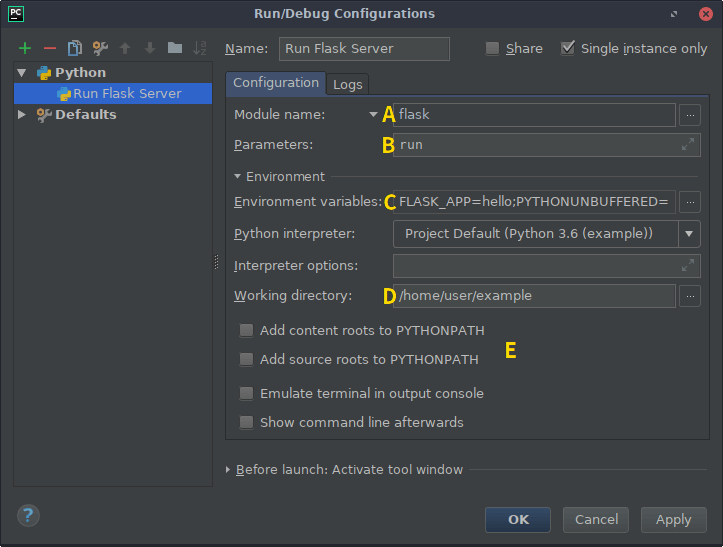

# Интерфейс командной строки Flask

При установке **Flask** в среду **virtualenv** устанавливается скрипт **flask**, интерфейс командной строки [Click](https://click.palletsprojects.com/en/7.x/). Этот сценарий, выполняемый из терминала, дает доступ к встроенным командам, командам расширения и командам, определяемым приложением. Параметр `--help` предоставит дополнительную информацию о любых командах и параметрах.

## Обнаружение приложений

Команда **flask** устанавливается **Flask**, а не вашим приложением; необходимо указать, где найти ваше приложение, чтобы использовать его. Переменная среды **FLASK\_APP** используется для указания способа загрузки приложения.

Unix Bash (Linux, Mac и т. д.):

```bash
$ export FLASK_APP=hello
$ flask run
```

Windows CMD:

```bash
> set FLASK_APP=hello
> flask run
```

Windows PowerShell:

```bash
> $env:FLASK_APP = "hello"
> flask run
```

Хотя **FLASK\_APP** поддерживает множество параметров для указания вашего приложения, большинство вариантов использования должны быть простыми. Вот типичные значения:

* (**nothing**) - Файл `wsgi.py` импортируется, автоматически обнаруживая приложение (**app**). Это обеспечивает простой способ создать приложение из фабрики с дополнительными аргументами.
* &#x20;**FLASK\_APP=hello** - Имя импортируется, автоматически обнаруживая приложение (**app**) или фабрику (**create\_app**).

**FLASK\_APP** состоит из трех частей: необязательного пути, который устанавливает текущий рабочий каталог, файла Python или пути импорта, разделенного точками, и необязательного имени переменной экземпляра или фабрики. Если имя является фабричным, оно может сопровождаться аргументами в круглых скобках. Следующие значения демонстрируют эти части:

* &#x20;**FLASK\_APP=src/hello -** Устанавливает текущий рабочий каталог на **src**, затем импортирует **hello**.
* &#x20;**FLASK\_APP=hello.web -** Импортирует путь `hello.web`.
* &#x20;**FLASK\_APP=hello:app2 -** Использует экземпляр **app2** Flask в **hello**.
* &#x20;**FLASK\_APP="hello:create\_app('dev')" -** Фабрика **create\_app** в **hello** вызывается со строкой `'dev'` в качестве аргумента.

Если **FLASK\_APP** не установлен, команда попытается импортировать «app» или «wsgi» (как файл «`.py`» или пакет) и попытается обнаружить экземпляр приложения или фабрику.

В данном импорте команда ищет экземпляр приложения с именем **app** или **application**, а затем любой экземпляр приложения. Если экземпляр не найден, команда ищет фабричную функцию с именем **create\_app** или **make\_app**, которая возвращает экземпляр.

При вызове фабрики приложений, если фабрика принимает аргумент с именем **script\_info**, то экземпляр [ScriptInfo](../api-dokumentaciya-flask/interfeis-komandnoi-stroki-flask.md#klass-flask-cli-scriptinfo) передается как аргумент ключевого слова. Если фабрика приложения принимает только один аргумент и за именем фабрики нет скобок, экземпляр **ScriptInfo** передается как позиционный аргумент. Если за именем фабрики следуют круглые скобки, их содержимое анализируется как литералы Python и передается в качестве аргументов функции. Это означает, что строки по-прежнему должны быть в кавычках.

## Запуск сервера разработки

Команда [run](../api-dokumentaciya-flask/interfeis-komandnoi-stroki-flask.md#flask-cli-run\_command) запустит сервер разработки. В большинстве случаев он заменяет метод [Flask.run ()](../api-dokumentaciya-flask/obekt-prilozheniya-flask.md#run).

```bash
$ flask run
 * Serving Flask app "hello"
 * Running on http://127.0.0.1:5000/ (Press CTRL+C to quit)
```


Не используйте эту команду для запуска вашего приложения в производственной среде. Используйте сервер разработки только во время разработки. Сервер разработки предоставляется для удобства, но не предназначен для обеспечения особой безопасности, стабильности или эффективности. См. [Параметры развертывания](flask-i-varianty-razvertyvaniya/), чтобы узнать, как работать в производственной среде.


## Открыть оболочку

Чтобы исследовать данные в вашем приложении, вы можете запустить интерактивную оболочку Python с помощью команды [shell](../api-dokumentaciya-flask/interfeis-komandnoi-stroki-flask.md#flask-cli-shell\_command). Контекст приложения будет активен, а экземпляр приложения будет импортирован.

```bash
$ flask shell
Python 3.6.2 (default, Jul 20 2017, 03:52:27)
[GCC 7.1.1 20170630] on linux
App: example
Instance: /home/user/Projects/hello/instance
>>>
```

Используйте [shell\_context\_processor ()](../api-dokumentaciya-flask/obekt-prilozheniya-flask.md#shell\_context\_processor), чтобы добавить другой автоматический импорт.

## Среды Environments

_Новое в версии 1.0_.

Среда, в которой работает приложение **Flask**, задается переменной среды **FLASK\_ENV**. Если не установлен, по умолчанию используется версия `'production'`. Другая признанная среда - это `'development'`. **Flask** и расширения могут выбрать включение поведения в зависимости от среды.

Если **env** настроен на **development**, команда `flask` включит режим отладки, а `flask run` включит интерактивный отладчик и перезагрузчик.

```bash
$ FLASK_ENV=development flask run
 * Serving Flask app "hello"
 * Environment: development
 * Debug mode: on
 * Running on http://127.0.0.1:5000/ (Press CTRL+C to quit)
 * Restarting with inotify reloader
 * Debugger is active!
 * Debugger PIN: 223-456-919
```

### Смотрите дополнительные файлы с помощью Reloader

При использовании режима разработки **development** перезагрузчик запускается всякий раз, когда изменяется ваш код Python или импортированные модули. Перезагрузчик может просматривать дополнительные файлы с помощью параметра `--extra-files` или переменной среды **FLASK\_RUN\_EXTRA\_FILES**. Несколько путей разделяются `:` или `;` в Windows.

```bash
$ flask run --extra-files file1:dirA/file2:dirB/
# или
$ export FLASK_RUN_EXTRA_FILES=file1:dirA/file2:dirB/
$ flask run
 * Running on http://127.0.0.1:8000/
 * Detected change in '/path/to/file1', reloading
```

## Режим отладки

Режим отладки будет включен, когда **FLASK\_ENV** находится в **development**, как описано выше. Если вы хотите управлять режимом отладки отдельно, используйте **FLASK\_DEBUG**. Значение `1` включает его, `0` отключает.

## Переменные среды из dotenv

Вместо того, чтобы устанавливать **FLASK\_APP** каждый раз, когда вы открываете новый терминал, вы можете использовать поддержку **Flask** `dotenv` для автоматической установки переменных среды.

Если установлен [python-dotenv](https://github.com/theskumar/python-dotenv#readme), запуск команды **flask** установит переменные среды, определенные в файлах `.env` и `.flaskenv`. Это можно использовать, чтобы избежать необходимости устанавливать **FLASK\_APP** вручную каждый раз, когда вы открываете новый терминал, а также для настройки конфигурации с использованием переменных среды, аналогичных тому, как работают некоторые службы развертывания.

Переменные, установленные в командной строке, используются вместо переменных, установленных в `.env`, которые используются вместо переменных, установленных в `.flaskenv`. `.flaskenv` следует использовать для общедоступных переменных, таких как **FLASK\_APP**, а `.env` не следует фиксировать в вашем репозитории, чтобы он мог устанавливать частные переменные.

Каталоги сканируются вверх от каталога, из которого вы вызываете **flask**, чтобы найти файлы. Текущий рабочий каталог будет установлен в расположение файла, при условии, что это каталог проекта верхнего уровня.

Файлы загружаются только командой **flask** или вызовом [run ()](../api-dokumentaciya-flask/obekt-prilozheniya-flask.md#run). Если вы хотите загрузить эти файлы при работе в производственной среде, вам следует вызвать [load\_dotenv ()](../api-dokumentaciya-flask/interfeis-komandnoi-stroki-flask.md#flask-cli-load\_dotenv) вручную.

### Настройка параметров команды

**Click** настроен для загрузки значений по умолчанию для параметров команды из переменных среды. Переменные используют шаблон **FLASK\_COMMAND\_OPTION**. Например, чтобы установить порт для команды **run** вместо `flask run --port 8000`:

```bash
$ export FLASK_RUN_PORT=8000
$ flask run
 * Running on http://127.0.0.1:8000/
```

Их можно добавить в файл `.flaskenv`, как и **FLASK\_APP**, для управления параметрами команд по умолчанию.

### Отключение dotenv

Команда **flask** покажет сообщение, если обнаружит файлы **dotenv**, но **python-dotenv** не установлен.

```bash
$ flask run
 * Tip: There are .env files present. Do "pip install python-dotenv" to use them.
```

Вы можете указать **Flask** не загружать файлы **dotenv**, даже если установлен **python-dotenv**, установив переменную среды **FLASK\_SKIP\_DOTENV**. Это может быть полезно, если вы хотите загрузить их вручную или если вы используете средство выполнения проекта, которое их уже загружает. Помните, что переменные среды должны быть установлены до загрузки приложения, иначе оно не будет настроено должным образом.

```bash
$ export FLASK_SKIP_DOTENV=1
$ flask run
```

## Переменные окружения из virtualenv

Если вы не хотите устанавливать поддержку **dotenv**, вы все равно можете установить переменные среды, добавив их в конец **activate** скрипта **virtualenv**. Активация **virtualenv** установит переменные.

&#x20;Unix Bash, `venv/bin/activate`:

```bash
$ export FLASK_APP=hello
```

&#x20;Windows CMD, `venv\Scripts\activate.bat`:

```bash
> set FLASK_APP=hello
```

Вместо этого рекомендуется использовать поддержку **dotenv**, поскольку `.flaskenv` может быть зафиксирован в репозитории, чтобы он работал автоматически, где бы проект ни был разрегистрирован.

## Пользовательские команды

Команда **flask** реализована с помощью **Click**. См. [документацию этого проекта](https://click.palletsprojects.com/en/7.x/) для получения полной информации о написании команд.

В этом примере добавляется команда **create-user**, которая принимает аргумент **name**.

```python
import click
from flask import Flask

app = Flask(__name__)

@app.cli.command("create-user")
@click.argument("name")
def create_user(name):
    ...
```

```bash
$ flask create-user admin
```

В этом примере добавляется та же команда, но как команда группы `user create`. Это полезно, если вы хотите организовать несколько связанных команд.

```python
import click
from flask import Flask
from flask.cli import AppGroup

app = Flask(__name__)
user_cli = AppGroup('user')

@user_cli.command('create')
@click.argument('name')
def create_user(name):
    ...

app.cli.add_command(user_cli)
```

```bash
$ flask user create demo
```

См. раздел [тестирование команд CLI](testirovanie-prilozhenii-flask.md#testirovanie-cli-komand) для обзора того, как тестировать пользовательские команды.

### Регистрация команд с помощью Blueprints

Если ваше приложение использует _**blueprints**_, вы можете дополнительно зарегистрировать команды CLI непосредственно на них. Когда ваш _**blueprint**_ будет зарегистрирован в вашем приложении, соответствующие команды будут доступны команде **flask**. По умолчанию эти команды будут вложены в группу, соответствующую имени _**blueprint**_.

```python
from flask import Blueprint

bp = Blueprint('students', __name__)

@bp.cli.command('create')
@click.argument('name')
def create(name):
    ...

app.register_blueprint(bp)
```

```bash
$ flask students create alice
```

Вы можете изменить имя группы, указав параметр **cli\_group** при создании объекта [Blueprint](../api-dokumentaciya-flask/obekty-blueprint.md#klass-flask-blueprint) или позже с помощью [app.register\_blueprint (bp, cli\_group = '...')](../api-dokumentaciya-flask/obekt-prilozheniya-flask.md#register\_blueprint). Следующие варианты эквивалентны:

```python
bp = Blueprint('students', __name__, cli_group='other')
# или
app.register_blueprint(bp, cli_group='other')
```

```bash
$ flask other create alice
```

Указание `cli_group = None` удалит вложенность и объединит команды непосредственно на уровне приложения:

```python
bp = Blueprint('students', __name__, cli_group=None)
# или
app.register_blueprint(bp, cli_group=None)
```

```bash
$ flask create alice
```

### Контекст приложения

Команды, добавленные с помощью декоратора **cli** [command ()](../api-dokumentaciya-flask/interfeis-komandnoi-stroki-flask.md#command) приложения **Flask**, будут выполняться с добавленным контекстом приложения, поэтому ваша команда и расширения имеют доступ к приложению и его конфигурации. Если вы создаете команду с помощью декоратора **Click** [command ()](https://click.palletsprojects.com/en/7.x/api/#click.command) вместо декоратора **Flask**, вы можете использовать [with\_appcontext ()](../api-dokumentaciya-flask/interfeis-komandnoi-stroki-flask.md#flask-cli-with\_appcontext) для получения того же поведения.

```python
import click
from flask.cli import with_appcontext

@click.command()
@with_appcontext
def do_work():
    ...

app.cli.add_command(do_work)
```

Если вы уверены, что команде не нужен контекст, вы можете отключить ее:

```python
@app.cli.command(with_appcontext=False)
def do_work():
    ...
```

## Плагины

**Flask** автоматически загрузит команды, указанные в [точке входа](https://packaging.python.org/tutorials/packaging-projects/#entry-points) `flask.commands`. Это полезно для расширений, которые хотят добавлять команды при их установке. Точки входа указаны в `setup.py`

```python
from setuptools import setup

setup(
    name='flask-my-extension',
    ...,
    entry_points={
        'flask.commands': [
            'my-command=flask_my_extension.commands:cli'
        ],
    },
)
```

Затем внутри `flask_my_extension/commands.py` вы можете экспортировать объект **Click**:

```python
import click

@click.command()
def cli():
    ...
```

После того, как этот пакет установлен в том же виртуальном окружении **virtualenv**, что и ваш проект **Flask**, вы можете запустить `flask my-command`, чтобы вызвать команду.

## Пользовательские скрипты

Когда вы используете шаблон фабрики приложений, может быть удобнее определить собственный скрипт **Click**. Вместо того чтобы использовать **FLASK\_APP** и позволить **Flask** загружать ваше приложение, вы можете создать свой собственный объект **Click** и экспортировать его как точку входа в [консольный скрипт](https://packaging.python.org/tutorials/packaging-projects/#console-scripts).

Создайте экземпляр [FlaskGroup](../api-dokumentaciya-flask/interfeis-komandnoi-stroki-flask.md#klass-flask-cli-flaskgroup) и передайте его фабрике:

```python
import click
from flask import Flask
from flask.cli import FlaskGroup

def create_app():
    app = Flask('wiki')
    # другая настройка
    return app

@click.group(cls=FlaskGroup, create_app=create_app)
def cli():
    """Скрипт управления для Wiki-приложения."""
```

Определите точку входа в `setup.py`:

```python
from setuptools import setup

setup(
    name='flask-my-extension',
    ...,
    entry_points={
        'console_scripts': [
            'wiki=wiki:cli'
        ],
    },
)
```

Установите приложение в **virtualenv** в редактируемом режиме, и пользовательский сценарий станет доступен. Обратите внимание, что вам не нужно устанавливать **FLASK\_APP**.

```bash
$ pip install -e .
$ wiki run
```


**Ошибки в пользовательских скриптах:**

При использовании настраиваемого сценария, если вы вводите ошибку в коде уровня модуля, перезагрузчик завершится ошибкой, потому что он больше не сможет загружать точку входа.

Команда **flask**, будучи отдельной от вашего кода, не имеет этой проблемы и рекомендуется в большинстве случаев.


## Интеграция PyCharm

**PyCharm Professional** предоставляет специальную конфигурацию запуска **Flask**. Для **Community Edition** нам нужно настроить его для вызова команды CLI `flask run` с правильными переменными среды. Эти инструкции должны быть аналогичными для любой другой IDE, которую вы, возможно, захотите использовать.

В **PyCharm** при открытом проекте нажмите «**Run**» в строке меню и перейдите в «**Edit configurations**». Вас поприветствует экран, подобный этому:



Есть довольно много вариантов, которые можно изменить, но как только мы сделаем это для одной команды, мы можем легко скопировать всю конфигурацию и сделать одну настройку, чтобы предоставить нам доступ к другим командам, включая любые пользовательские, которые вы можете реализовать самостоятельно.

Нажмите кнопку + (_**Add New Configuration**_) и выберите **Python**. Дайте конфигурации имя, например, «**flask run**». Для команды запуска **flask run** отметьте «Single instance only», так как вы не можете запускать сервер более одного раза одновременно.

Выберите _**Module name**_ из раскрывающегося списка (**A**), затем введите **flask**.

В поле «_**Parameters**_» (**B**) указывается команда CLI для выполнения (с любыми аргументами). В этом примере мы используем **run**, который запускает сервер разработки.

Вы можете пропустить этот следующий шаг, если используете [переменные среды из dotenv](interfeis-komandnoi-stroki-flask.md#peremennye-sredy-iz-dotenv). Нам нужно добавить переменную среды (**C**) для идентификации нашего приложения. Нажмите кнопку обзора и добавьте запись с **FLASK\_APP** слева и импортом Python или файлом справа (например, **hello**). Добавьте запись с **FLASK\_ENV** и установите для нее **development**.

Затем нам нужно установить рабочий каталог (**D**) как папку, в которой находится наше приложение.

Если вы установили свой проект как пакет в своем **virtualenv**, вы можете отключить параметры **PYTHONPATH** (**E**). Это будет более точно соответствовать тому, как вы позже развернете приложение.

Нажмите _**Apply**_, чтобы сохранить конфигурацию, или _**ОК**_, чтобы сохранить и закрыть окно. Выберите конфигурацию в главном окне **PyCharm** и нажмите кнопку воспроизведения рядом с ней, чтобы запустить сервер.

Теперь, когда у нас есть конфигурация, которая запускает `flask run` из **PyCharm**, мы можем скопировать эту конфигурацию и изменить аргумент _**Script**_ для запуска другой команды CLI, например `flask shell`.
